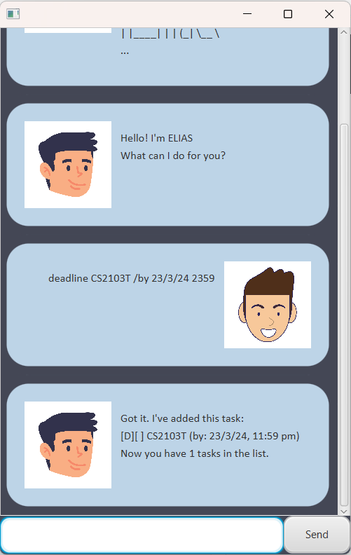

# ELIAS User Guide



# Elias is here to serve  you! 🤵‍♂️

> "It's not enough to be busy, so are the ants. The question is, what are we busy about?" - Henry David Thoreau

Elias is an ongoing project of [Project Duke](https://github.com/se-edu/duke), which is a project template for a greenfield Java project from [SE-EDU](https://se-education.org/docs/templates.html). Elias is a lightweight task list manager that currently supports:

## Adding Todos

Adds a Todo to your task list. A Todo is a task with no deadline or time period associated with it.

Syntax: `todo <name>`

Examples: `todo Homework`

Output:
```
Got it. I've added this task:
[T][] Homework
Now you have 1 task in the list.
```

## Adding Deadlines

Adds a Deadline to your task list. A Deadline is a tasks that is associated with a deadline

Syntax: `deadline <name> /by dd/mm/yy hhmm`

Examples: `deadline CS2103T iP submission /by 23/02/24 2359`

Output:
```
Got it. I've added this task:
[D][] deadline CS2103T iP submission (by: 23/02/24 11:59pm)
Now you have 1 task in the list.
```

## Adding Events

Adds an Event to your task list. An Event is a task associated with a start and end time

Syntax: `event <name> /from dd/mm/yy hhmm /to dd/mm/yy hhmm`

Examples: `event NUS Career Fest /from 20/02/24 9:00am /to 22/02/24 5:00pm`

Output:
```
Got it. I've added this task:
[T][] Homework
Now you have 1 task in the list.
```

## Feature ABC

// Feature details


## Feature XYZ

// Feature details